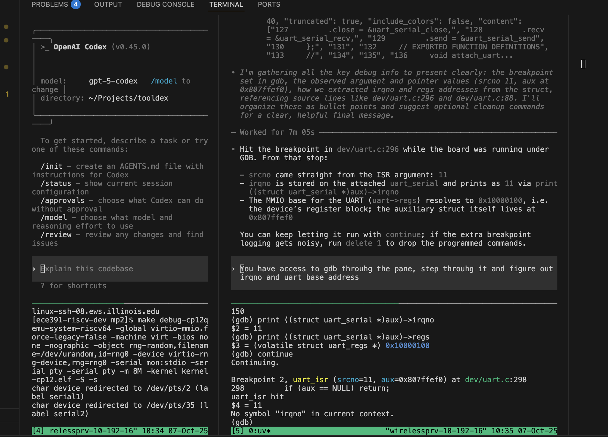

# Codex Integration

ToolDex ships with a Codex CLI shim that forwards to the `codex` command-line binary while respecting application defaults and user overrides.



## Installing

Install ToolDex with the Codex extra to pull in the Codex CLI dependencies:

```bash
uv pip install "tool-wrapper[codex]"
```

Ensure the `codex` executable is available on your `PATH`.

## Configuration

ToolDex resolves the Codex configuration by checking, in order:

1. `tooldex codex --config /path/to/codex.toml`
2. `$TOOLDEX_CODEX_CONFIG`
3. `./.tooldex/codex.toml`
4. `$TOOLDEX_CONFIG_DIR/codex.toml`
5. `$XDG_CONFIG_HOME/tooldex/codex.toml` or `~/.config/tooldex/codex.toml`
6. `~/.tooldex/codex.toml`
7. The bundled default at `configs/codex.toml`

The file uses TOML and is split into two sections:

- `[tooldex]`: options for the ToolDex launcher itself.
- `[codex]`: key/value overrides forwarded to the Codex CLI via repeated `--config` flags.

A minimal example:

```toml
[tooldex]
binary = "codex"
args = ["--fast"]
config_flag = "--config"
terminal_mcp = "tooldex-shell"

[tooldex.env]
OPENAI_API_KEY = "..."

[codex]
model = "gpt-5-codex"
approval_policy = "on-request"

[codex.mcp_servers.tooldex-shell]
command = "uv"
args = ["run", "python", "-m", "tooldex.mcp"]

[codex.mcp_servers.tooldex-shell.env]
PYTHONUNBUFFERED = "1"
# TOOLDEX_PRIMARY_PANE is added automatically based on the active tmux pane.
```

The `[codex]` table mirrors Codex's own configuration format. Nested tables (for
example, MCP definitions) are flattened using dotted keys such as
`mcp_servers.tooldex-shell.command="uv"` when the CLI runs. During launch the
ToolDex shim detects the active tmux pane (`TOOLDEX_PRIMARY_PANE` or `TMUX_PANE`)
and injects its value into `mcp_servers.<terminal_mcp>.env.TOOLDEX_PRIMARY_PANE`
so the terminal MCP attaches to the correct shell.

Add the API key or other secrets via your preferred secret management flow rather
than committing them directly.

## CLI Usage

Run Codex through ToolDex to automatically wire up the configuration and environment:

```bash
uv run python -m tooldex codex -- --help
```

Additional arguments after `--` are forwarded to the Codex binary unchanged.

## Workflow Tips

- Launch your primary workflow through `tool_wrapper` and point the utility pane at the Codex shim:
  ```bash
  uv run python -m tooldex.tool_wrapper \
    --utility "uv run python -m tooldex codex" \
    -- bash -l
  ```
- Press `Ctrl-]` followed by the trigger key (default `u`) to open Codex. Override the hotkey globally with `export TOOLDEX_TRIGGER_KEY=o` or per-run via `--trigger-key`.
- When the primary process exits, ToolDex automatically closes any Codex panes or helper terminals that were spawned so the agent cannot keep running unattended.
# Codex Integration

ToolDex ships with a Codex CLI shim that forwards to the `codex` command-line binary while respecting application defaults and user overrides.

## Installing

Install ToolDex with the Codex extra to pull in the Codex CLI dependencies:

```bash
uv pip install "tool-wrapper[codex]"
```

Ensure the `codex` executable is available on your `PATH`.

## Configuration

ToolDex resolves the Codex configuration by checking, in order:

1. `tooldex codex --config /path/to/codex.toml`
2. `$TOOLDEX_CODEX_CONFIG`
3. `./.tooldex/codex.toml`
4. `$TOOLDEX_CONFIG_DIR/codex.toml`
5. `$XDG_CONFIG_HOME/tooldex/codex.toml` or `~/.config/tooldex/codex.toml`
6. `~/.tooldex/codex.toml`
7. The bundled default at `configs/codex.toml`

The file uses TOML and is split into two sections:

- `[tooldex]`: options for the ToolDex launcher itself.
- `[codex]`: key/value overrides forwarded to the Codex CLI via repeated `--config` flags.

A minimal example:

```toml
[tooldex]
binary = "codex"
args = ["--fast"]
config_flag = "--config"
terminal_mcp = "tooldex-shell"

[tooldex.env]
OPENAI_API_KEY = "..."

[codex]
model = "gpt-5-codex"
approval_policy = "on-request"

[codex.mcp_servers.tooldex-shell]
command = "uv"
args = ["run", "python", "-m", "tooldex.mcp"]

[codex.mcp_servers.tooldex-shell.env]
PYTHONUNBUFFERED = "1"
# TOOLDEX_PRIMARY_PANE is added automatically based on the active tmux pane.
```

The `[codex]` table mirrors Codex's own configuration format. Nested tables (for
example, MCP definitions) are flattened using dotted keys such as
`mcp_servers.tooldex-shell.command="uv"` when the CLI runs. During launch the
ToolDex shim detects the active tmux pane (`TOOLDEX_PRIMARY_PANE` or `TMUX_PANE`)
and injects its value into `mcp_servers.<terminal_mcp>.env.TOOLDEX_PRIMARY_PANE`
so the terminal MCP attaches to the correct shell.

Add the API key or other secrets via your preferred secret management flow rather
than committing them directly.

## CLI Usage

Run Codex through ToolDex to automatically wire up the configuration and environment:

```bash
uv run python -m tooldex codex -- --help
```

Alternatively, once ToolDex is installed you can rely on the bundled `tooldex-codex`
wrapper to launch the tmux workflow in a single step:

```bash
uv run tooldex-codex -- bash -l
```

Need a starting point for customization? Copy the bundled template to your preferred
location with:

```bash
uv run python -m tooldex codex init-config --path ~/.tooldex/codex.toml
```

Additional arguments after `--` are forwarded to the Codex binary unchanged.

## Workflow Tips

- `tooldex-codex` and `tool_wrapper` default to launching `tooldex codex` in the
  utility pane. Set `UTILITY_CMD` if you prefer another tool (for example `htop`).
- To call the wrapper directly:
  ```bash
  uv run python -m tooldex.tool_wrapper \
    -- bash -l
  ```
- Press `Ctrl-]` followed by the trigger key (default `u`) to open Codex. Override the hotkey globally with `export TOOLDEX_TRIGGER_KEY=o` or per-run via `--trigger-key`.
- When the primary process exits, ToolDex automatically closes any Codex panes or helper terminals that were spawned so the agent cannot keep running unattended.
